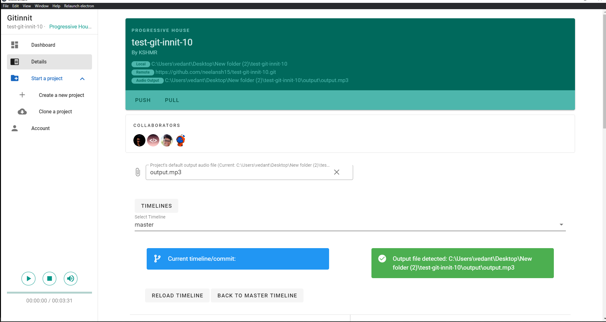

# Git Innit - Version Control for Musicians
Git innit is an innovative and cross-platform desktop app bringing the tools used in software development to the music industry for greatly enhancing the efficiency and management of music projects. 

